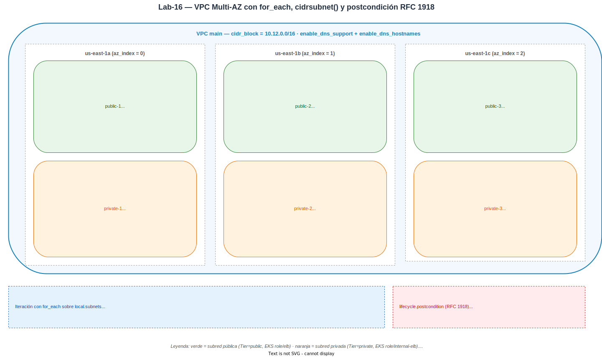

# Laboratorio 16 — Construcción de una Red Multi-AZ Robusta y Dinámica


[← Módulo 5 — Networking en AWS con Terraform](../../modulos/modulo-05/README.md)


## Visión general

Implementar el plano maestro de una VPC profesional utilizando **funciones de cálculo dinámico** e **iteración**, creando una red lista para cargas de trabajo como EKS.

## Conceptos clave

| Concepto | Descripción |
|---|---|
| **`for_each`** | Meta-argumento que crea múltiples instancias de un recurso a partir de un mapa o conjunto, permitiendo referenciar cada instancia por su clave |
| **`cidrsubnet()`** | Función que calcula rangos de subred a partir de un CIDR base, eliminando errores de cálculo manual |
| **`merge()`** | Función que combina múltiples mapas en uno solo; las claves del último mapa prevalecen sobre las anteriores |
| **`lifecycle` / `postcondition`** | Bloque que valida propiedades del recurso **después** de crearlo o actualizarlo; falla el apply si la condición no se cumple |
| **Tags EKS** | Etiquetas `kubernetes.io/role/elb` y `kubernetes.io/role/internal-elb` que permiten a EKS descubrir automáticamente qué subredes usar para balanceadores públicos e internos |
| **Multi-AZ** | Distribución de recursos en múltiples zonas de disponibilidad para alta disponibilidad |
| **RFC 1918** | Rangos de IP privados: `10.0.0.0/8`, `172.16.0.0/12`, `192.168.0.0/16` |

## Prerrequisitos

- lab02 desplegado: bucket `terraform-state-labs-<ACCOUNT_ID>` con versionado habilitado (usado como backend de tfstate)
- AWS CLI configurado con credenciales válidas
- Terraform >= 1.10 (necesario para `use_lockfile` en el backend S3)

```bash
# Exportar el Account ID y nombre del bucket para usar en los comandos
export ACCOUNT_ID=$(aws sts get-caller-identity --query Account --output text)
export BUCKET="terraform-state-labs-${ACCOUNT_ID}"
echo "Bucket: $BUCKET"
```

## Estructura del proyecto

```
lab-16/
├── README.md                    ← Esta guía
├── aws/
│   ├── providers.tf             ← Backend S3 parcial
│   ├── variables.tf             ← Variables: región, CIDR, proyecto, entorno
│   ├── main.tf                  ← VPC + 6 subredes con for_each y cidrsubnet()
│   ├── outputs.tf               ← IDs, CIDRs y AZs
│   └── aws.s3.tfbackend         ← Parámetros del backend (sin bucket)
└── localstack/
    ├── README.md                ← Guía específica para LocalStack
    ├── providers.tf
    ├── variables.tf
    ├── main.tf
    ├── outputs.tf
    └── localstack.s3.tfbackend  ← Backend completo para LocalStack
```

## Arquitectura



Una única VPC `10.12.0.0/16` con 6 subredes distribuidas en 3 AZs (3 públicas + 3 privadas), todas generadas con un único recurso `aws_subnet.this` iterando sobre `local.subnets` con `for_each`. Los CIDRs se calculan con `cidrsubnet()` para evitar errores manuales y los tags incluyen los marcadores `kubernetes.io/role/{elb,internal-elb}` que EKS usa para descubrir subredes. Una `postcondition` rechaza el apply si el CIDR no es RFC 1918. **Aún no hay IGW ni NAT Gateway** — el routing real a Internet llega en el [lab-17](../lab-17/README.md).

## Análisis del código antes de desplegar

Antes de ejecutar nada, revisemos las técnicas clave del código en `main.tf`.

### 1.1 La VPC y la resolución DNS

```hcl
resource "aws_vpc" "main" {
  cidr_block           = var.vpc_cidr
  enable_dns_support   = true
  enable_dns_hostnames = true

  tags = merge(local.common_tags, {
    Name = "vpc-${var.project_name}"
  })

  lifecycle {
    postcondition { ... }   # Ver sección 1.5
  }
}
```

Tres atributos clave de la VPC:

- **`cidr_block`** — el rango privado a partir del cual `cidrsubnet()` (sección 1.2) deriva las subredes. Por defecto `10.12.0.0/16`. AWS permite cualquier CIDR IPv4 (también públicos), pero la postcondición de la sección 1.5 obliga a usar uno RFC 1918.
- **`enable_dns_support = true`** — habilita el servidor DNS interno de la VPC (`AmazonProvidedDNS`, accesible en `10.12.0.2` en este caso). Sin él, las instancias no resuelven nombres dentro de la VPC.
- **`enable_dns_hostnames = true`** — hace que las instancias EC2 con IP pública reciban además un *hostname* DNS público (`ec2-X-X-X-X.compute.amazonaws.com`).

Ambos flags son **requisitos previos para EKS**: el plano de control de Kubernetes resuelve los nodos por hostname y los servicios por DNS; sin estas dos opciones a `true`, el cluster no funciona. De ahí que las dejemos activadas desde el lab base de red.

### 1.2 Cálculo dinámico de CIDRs con `cidrsubnet()`

```hcl
cidr_block = cidrsubnet(aws_vpc.main.cidr_block, 8, each.value.subnet_index)
```

La función `cidrsubnet(prefix, newbits, netnum)` calcula subredes automáticamente:

- **`prefix`**: el CIDR base de la VPC (`10.12.0.0/16`)
- **`newbits`**: bits adicionales para la subred (`8` → de `/16` a `/24` = 256 IPs por subred)
- **`netnum`**: número de la subred dentro del espacio disponible

Con el CIDR `10.12.0.0/16` y `newbits = 8`, el cálculo produce:

| Subred | `netnum` | CIDR resultante | IPs disponibles |
|---|---|---|---|
| public-1 | 0 | `10.12.0.0/24` | 251 |
| public-2 | 1 | `10.12.1.0/24` | 251 |
| public-3 | 2 | `10.12.2.0/24` | 251 |
| private-1 | 10 | `10.12.10.0/24` | 251 |
| private-2 | 11 | `10.12.11.0/24` | 251 |
| private-3 | 12 | `10.12.12.0/24` | 251 |

> **Nota:** AWS reserva 5 IPs por subred (red, router, DNS, reservada, broadcast), por eso 256 - 5 = 251 disponibles.

Los `netnum` de las subredes privadas (10, 11, 12) están separados intencionalmente de las públicas (0, 1, 2), dejando espacio para futuras subredes intermedias.

### 1.3 Iteración con `for_each`

```hcl
resource "aws_subnet" "this" {
  for_each = local.subnets
  # ...
}
```

En lugar de repetir 6 bloques `resource`, definimos un único recurso con `for_each` que itera sobre un mapa. Cada entrada del mapa tiene:

- **`az_index`**: índice de la AZ en la lista `local.azs`
- **`subnet_index`**: número para `cidrsubnet()`
- **`public`**: booleano que determina si la subred es pública

Terraform crea instancias identificadas por clave: `aws_subnet.this["public-1"]`, `aws_subnet.this["private-2"]`, etc. Esto es más robusto que `count` porque renombrar o reordenar subredes no fuerza la destrucción y recreación.

### 1.4 Tags dinámicos con `merge()`

```hcl
tags = merge(
  local.common_tags,                    # Tags base (Environment, ManagedBy, Project)
  { Name = "...", Tier = "..." },       # Tags específicos de la subred
  each.value.public ? {                 # Tags condicionales para EKS
    "kubernetes.io/role/elb" = "1"
  } : {
    "kubernetes.io/role/internal-elb" = "1"
  }
)
```

`merge()` combina tres mapas en uno:
1. **Tags comunes** definidos en `local.common_tags` — se aplican a todos los recursos
2. **Tags específicos** de cada subred (nombre y tier)
3. **Tags EKS** condicionales — las subredes públicas reciben `kubernetes.io/role/elb` y las privadas `kubernetes.io/role/internal-elb`

### 1.5 Postcondición para validar RFC 1918

```hcl
lifecycle {
  postcondition {
    condition = can(regex("^(10\\.|172\\.(1[6-9]|2[0-9]|3[01])\\.|192\\.168\\.)", self.cidr_block))
    error_message = "El CIDR de la VPC debe pertenecer a un rango privado RFC 1918 (10.0.0.0/8, 172.16.0.0/12 o 192.168.0.0/16)."
  }
}
```

La `postcondition` se evalúa **después** de que el recurso se crea o actualiza. Usa `self` para referenciar los atributos del propio recurso. Si alguien intenta desplegar con un CIDR público (por ejemplo `203.0.113.0/24`), Terraform abortará el apply con un mensaje descriptivo.

---

## Despliegue

```bash
cd labs/lab-16/aws

terraform init \
  -backend-config=aws.s3.tfbackend \
  -backend-config="bucket=$BUCKET"

terraform apply
```

Revisa el plan antes de confirmar. Terraform creará **7 recursos**: 1 VPC + 6 subredes.

Verifica los outputs:

```bash
terraform output
# vpc_id             = "vpc-0abc123..."
# vpc_cidr           = "10.12.0.0/16"
# availability_zones = ["us-east-1a", "us-east-1b", "us-east-1c"]
# subnet_cidrs       = {
#   "private-1" = "10.12.10.0/24"
#   "private-2" = "10.12.11.0/24"
#   "private-3" = "10.12.12.0/24"
#   "public-1"  = "10.12.0.0/24"
#   "public-2"  = "10.12.1.0/24"
#   "public-3"  = "10.12.2.0/24"
# }
```

---

## Verificación final

### 3.1 Verificar la VPC

```bash
aws ec2 describe-vpcs \
  --filters Name=tag:Project,Values=lab16 \
  --query 'Vpcs[*].[VpcId,CidrBlock,Tags[?Key==`Name`].Value|[0]]' \
  --output table
```

### 3.2 Verificar las subredes y su distribución por AZ

```bash
aws ec2 describe-subnets \
  --filters Name=tag:Project,Values=lab16 \
  --query 'Subnets[*].[Tags[?Key==`Name`].Value|[0],AvailabilityZone,CidrBlock,MapPublicIpOnLaunch]' \
  --output table
```

Deberías ver 6 subredes distribuidas en 3 AZs, con las públicas marcadas con `MapPublicIpOnLaunch = True`.

### 3.3 Verificar tags EKS

```bash
aws ec2 describe-subnets \
  --filters Name=tag:Project,Values=lab16 \
  --query 'Subnets[].{Name: Tags[?Key==`Name`].Value|[0], ELB: Tags[?Key==`kubernetes.io/role/elb`].Value|[0], InternalELB: Tags[?Key==`kubernetes.io/role/internal-elb`].Value|[0], Cluster: Tags[?Key==`kubernetes.io/cluster/lab16`].Value|[0]}' \
  --output table
```

Las subredes públicas deben tener `ELB = 1` y las privadas `InternalELB = 1`. Todas deben tener `Cluster = shared`.

---

## Probar la postcondición RFC 1918

Intenta desplegar con un CIDR público para verificar que la postcondición funciona:

```bash
terraform apply -var="vpc_cidr=203.0.113.0/24"
```

Terraform rechazará el apply con este error:

```
│ Error: Resource postcondition failed
│
│   on main.tf line XX, in resource "aws_vpc" "main":
│
│ El CIDR de la VPC debe pertenecer a un rango privado RFC 1918 (10.0.0.0/8, 172.16.0.0/12 o 192.168.0.0/16).
```

> **Nota:** AWS acepta cualquier CIDR IPv4 (incluidos rangos públicos como `203.0.113.0/24`) al crear una VPC, así que la VPC se llega a crear realmente; es Terraform —no el provider— quien marca el `apply` como fallido al evaluar la postcondición sobre `self.cidr_block`. Para corregirlo, vuelve a ejecutar `terraform apply` con un CIDR RFC 1918 válido: como el atributo `cidr_block` **no es modificable in-place**, Terraform planificará la recreación de la VPC (no una actualización) y, una vez aplicada, la postcondición pasará.

---

## Retos

### Reto 1 — Ampliar la red con subredes de base de datos

**Situación**: El equipo de base de datos necesita 3 subredes privadas adicionales dedicadas exclusivamente a RDS, aisladas de las subredes de aplicación existentes.

**Tu objetivo**:

1. Añadir 3 subredes `database-1`, `database-2` y `database-3` al mapa `local.subnets`
2. Usar `subnet_index` 20, 21 y 22 para separarlas de las subredes de aplicación
3. Asignar el tag `Tier = "database"` (en vez de `"private"`)
4. **No** incluir tags de EKS en estas subredes (las bases de datos no necesitan descubrimiento de Kubernetes)
5. Añadir un nuevo output `database_subnet_ids` con los IDs de las subredes de base de datos
6. Al finalizar, `terraform apply` debe crear las 3 subredes adicionales sin modificar las 6 existentes

**Pistas**:
- Necesitarás modificar `local.subnets` (para añadir las 3 nuevas entradas) y la lógica de tags en `main.tf`. La solución propuesta más adelante refactoriza el bloque de tags para basarse en un campo `tier` y un mapa `local.eks_tags`; ese refactor **toca también las subredes existentes** (todas pasan a leer `each.value.tier` y a obtener los tags EKS desde `lookup(...)`), por lo que conviene comprobar el `plan` con cuidado para asegurarte de que los tags resultantes son idénticos a los actuales y Terraform no marca cambios "fantasma" en las 6 subredes ya desplegadas.
- Como alternativa menos invasiva, puedes añadir una tercera rama al operador ternario (anidando otro condicional `each.value.tier == "database" ? {} : (each.value.public ? {…} : {…})`) y dejar las subredes existentes sin tocar la forma de leer los tags.
- ¿Cómo verificas que las nuevas subredes no afectaron a las existentes? Mira el resumen de `terraform plan`: el objetivo es ver únicamente recursos en `+ create` para `database-*` y ningún `~ update` sobre `public-*` / `private-*`.

---

## Soluciones

<details>
<summary><strong>Solución al Reto 1 — Ampliar la red con subredes de base de datos</strong></summary>

### Solución al Reto 1 — Ampliar la red con subredes de base de datos

#### Paso 1: Ampliar el mapa de subredes

Añade las 3 subredes de base de datos a `local.subnets` en `main.tf`:

```hcl
locals {
  subnets = {
    "public-1"    = { az_index = 0, subnet_index = 0,  public = true,  tier = "public" }
    "public-2"    = { az_index = 1, subnet_index = 1,  public = true,  tier = "public" }
    "public-3"    = { az_index = 2, subnet_index = 2,  public = true,  tier = "public" }
    "private-1"   = { az_index = 0, subnet_index = 10, public = false, tier = "private" }
    "private-2"   = { az_index = 1, subnet_index = 11, public = false, tier = "private" }
    "private-3"   = { az_index = 2, subnet_index = 12, public = false, tier = "private" }
    "database-1"  = { az_index = 0, subnet_index = 20, public = false, tier = "database" }
    "database-2"  = { az_index = 1, subnet_index = 21, public = false, tier = "database" }
    "database-3"  = { az_index = 2, subnet_index = 22, public = false, tier = "database" }
  }

  # Mapa de tags EKS por tier
  eks_tags = {
    "public" = {
      "kubernetes.io/role/elb"                    = "1"
      "kubernetes.io/cluster/${var.project_name}"  = "shared"
    }
    "private" = {
      "kubernetes.io/role/internal-elb"           = "1"
      "kubernetes.io/cluster/${var.project_name}"  = "shared"
    }
    "database" = {} # Sin tags EKS
  }
}
```

#### Paso 2: Actualizar los tags de las subredes

Reemplaza la lógica condicional de tags por un `lookup` en el mapa. **Importante:** este cambio afecta también a las 6 subredes existentes — pasan a leer `Tier` desde `each.value.tier` y los tags EKS desde `lookup(local.eks_tags, each.value.tier, {})`. Como los valores resultantes son idénticos a los que ya tenían (`Tier = "public"`/`"private"` y los mismos tags EKS), Terraform no debería marcar cambios; pero **vigila el `plan` antes de aplicar** para detectar cualquier diferencia accidental (espacios, comillas, claves nuevas).

```hcl
resource "aws_subnet" "this" {
  for_each = local.subnets

  vpc_id            = aws_vpc.main.id
  availability_zone = local.azs[each.value.az_index]
  cidr_block        = cidrsubnet(aws_vpc.main.cidr_block, 8, each.value.subnet_index)

  map_public_ip_on_launch = each.value.public

  tags = merge(
    local.common_tags,
    {
      Name = "${var.project_name}-${each.key}"
      Tier = each.value.tier
    },
    lookup(local.eks_tags, each.value.tier, {})
  )
}
```

#### Paso 3: Añadir el output

Añade en `outputs.tf`:

```hcl
output "database_subnet_ids" {
  description = "IDs de las subredes de base de datos"
  value = {
    for key, subnet in aws_subnet.this :
    key => subnet.id if local.subnets[key].tier == "database"
  }
}
```

#### Paso 4: Aplicar y verificar

```bash
terraform plan
# Resultado esperado (refactor "limpio"):
#   Plan: 3 to add, 0 to change, 0 to destroy.
```

> **Nota:** el `0 to change` depende de que el refactor produzca exactamente los mismos tags que tenían las 6 subredes originales. Si tu mapa `eks_tags` introduce alguna clave o valor distinto (por ejemplo, otro valor para `kubernetes.io/cluster/...`), Terraform detectará el cambio y lo reportará como `~ update in-place` sobre las subredes existentes. Eso no rompe nada (las modificaciones de tags se aplican en caliente), pero conviene revisar el `plan` línea por línea para descartar cambios involuntarios antes del `apply`.

```bash
terraform apply
```

Verifica que las 6 subredes originales no fueron modificadas (`0 to change`) y las 3 nuevas se crearon correctamente. Filtramos por el tag `Name` (que siempre vale `lab16-database-N`) en lugar de por `Tier`, ya que el valor de `Tier` depende del camino que hayas elegido en el Reto: con el refactor "limpio" será `database`, pero si optaste por la alternativa menos invasiva que solo toca el ternario de tags EKS, el `Tier` de las nuevas subredes seguirá siendo `private` (porque `public = false`):

```bash
aws ec2 describe-subnets \
  --filters "Name=tag:Project,Values=lab16" "Name=tag:Name,Values=lab16-database-*" \
  --query 'Subnets[*].[Tags[?Key==`Name`].Value|[0],AvailabilityZone,CidrBlock,Tags[?Key==`Tier`].Value|[0]]' \
  --output table
```

</details>

---

## Limpieza

```bash
terraform destroy
```

> **Nota:** El laboratorio no crea ningún bucket S3 propio. No destruyas el bucket de tfstate del lab02 (`terraform-state-labs-<ACCOUNT_ID>`), ya que es un recurso compartido entre laboratorios.

---

## LocalStack

Para ejecutar este laboratorio sin cuenta de AWS, consulta [localstack/README.md](localstack/README.md).

---

## Buenas prácticas aplicadas

- **`cidrsubnet()` para calcular subredes dinámicamente**: calcular los bloques CIDR de las subredes a partir del CIDR de la VPC usando `cidrsubnet()` garantiza que no hay solapamientos y que el código escala sin modificación cuando cambia el número de AZs.
- **`for_each` sobre AZs disponibles**: iterar sobre `data.aws_availability_zones.available.names` en lugar de hardcodear `["us-east-1a", "us-east-1b"]` hace el código portable entre regiones sin modificación.
- **Tags de discovery para EKS**: los tags `kubernetes.io/role/elb` y `kubernetes.io/role/internal-elb` son requeridos por EKS para descubrir automáticamente las subnets donde crear los Load Balancers.
- **Postcondición para validar RFC 1918**: una postcondición que verifica que el CIDR de la VPC pertenece al espacio privado (10.0.0.0/8, 172.16.0.0/12, 192.168.0.0/16) detecta errores de configuración antes de que lleguen a producción.
- **Separación lógica de subredes públicas y privadas desde el plano de direccionamiento**: aunque en este laboratorio la diferencia entre "pública" y "privada" se materializa **únicamente** a nivel de `map_public_ip_on_launch` y de tags (no hay aún Internet Gateway, NAT Gateway ni tablas de rutas), reservar desde el principio rangos CIDR distintos (`10.x.0.0/24`–`10.x.2.0/24` para públicas, `10.x.10.0/24`–`10.x.12.0/24` para privadas) y etiquetar la intención facilita aplicar más adelante políticas de routing y seguridad diferenciadas por capa. El **routing real a Internet (IGW para públicas, NAT Gateway para privadas) se añade en el [lab-17](../lab-17/README.md)**; en lab-16 una subred "pública" todavía no tiene salida a Internet.

---

## Recursos

- [Terraform: `cidrsubnet()` Function](https://developer.hashicorp.com/terraform/language/functions/cidrsubnet)
- [Terraform: `for_each` Meta-Argument](https://developer.hashicorp.com/terraform/language/meta-arguments/for_each)
- [Terraform: `merge()` Function](https://developer.hashicorp.com/terraform/language/functions/merge)
- [Terraform: Custom Conditions (Preconditions & Postconditions)](https://developer.hashicorp.com/terraform/language/validate)
- [AWS: VPC Subnet Basics](https://docs.aws.amazon.com/vpc/latest/userguide/configure-subnets.html)
- [EKS: Subnet Discovery Tags](https://docs.aws.amazon.com/eks/latest/userguide/network-reqs.html)
