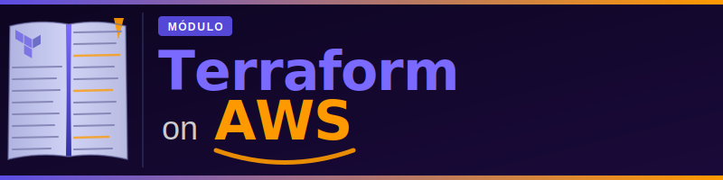

# Módulo 0 — Introducción al Curso: Terraform on AWS

> **Curso:** Terraform on AWS  
> **Instructor:** José Emilio Vera — Champion AWS Authorized Instructor

---

## Descripción

Este módulo de introducción presenta los objetivos del curso, los requisitos previos, la agenda completa y las expectativas de aprendizaje. Sirve como punto de partida antes de entrar en materia técnica.

---

## Objetivos del curso

Al finalizar el curso completo, el alumno será capaz de:

- **Instalar y configurar** Terraform en entornos AWS.
- **Aplicar el enfoque IaC** para gestionar entornos cloud completos.
- **Desplegar, modificar y destruir** infraestructura desde una única herramienta.
- **Escribir archivos de configuración** reutilizables, versionables y declarativos.
- **Automatizar el aprovisionamiento** de recursos AWS con pipelines CI/CD.
- **Gestionar el estado** de la infraestructura de forma segura y colaborativa.
- **Implementar seguridad** como código: IAM, KMS y secretos con Terraform.
- **Construir módulos** reutilizables para arquitecturas empresariales.

---

## Requerimientos

### Conocimientos previos

| Área | Nivel requerido |
|------|----------------|
| Línea de comandos (bash/zsh) | Básico |
| Conceptos cloud (qué es una instancia, un bucket, una VPC) | Básico |
| Git | Básico |
| AWS (experiencia en consola) | Recomendable |

### Herramientas necesarias

- Cuenta de AWS con permisos de administrador o usuario IAM equivalente.
- Terminal (Linux, macOS o WSL en Windows).
- Visual Studio Code.
- Acceso a internet para descargar paquetes.

---

## Agenda del curso

| Módulo | Título | Laboratorios |
|--------|--------|:---:|
| **Módulo 1** | [Fundamentos de Infraestructura como Código y Terraform](../modulo-01/README.md) | 0, 1, 2 |
| **Módulo 2** | [Lenguaje HCL y Configuración Avanzada](../modulo-02/README.md) | 3, 4, 5, 6 |
| **Módulo 3** | [Gestión del Estado (State)](../modulo-03/README.md) | 7, 7b, 8, 9, 10, 11 |
| **Módulo 4** | [Seguridad e IAM con Terraform](../modulo-04/README.md) | 12, 13, 14, 15 |
| **Módulo 5** | [Networking en AWS con Terraform](../modulo-05/README.md) | 16, 17, 18, 19, 20, 21 |
| **Módulo 6** | [Módulos de Terraform](../modulo-06/README.md) | 22, 23, 24, 25, 26 |
| **Módulo 7** | [Cómputo en AWS con Terraform](../modulo-07/README.md) | 27, 28, 29, 30, 31, 32 |
| **Módulo 8** | [Almacenamiento y Bases de Datos con Terraform](../modulo-08/README.md) | 33, 34, 35, 36 |
| **Módulo 9** | [Terraform Avanzado](../modulo-09/README.md) | 37, 38, 39, 40 |
| **Módulo 10** | [CI/CD y Automatización con Terraform](../modulo-10/README.md) | 41, 42, 43, 44, 45 |
| **Módulo 11** | [Observabilidad, Tagging y FinOps](../modulo-11/README.md) | 46, 47, 48, 49 |

---

## Metodología

El curso combina:

- **Teoría progresiva:** cada concepto se introduce con contexto y motivación antes de mostrar el código.
- **Laboratorios prácticos:** 51 laboratorios que refuerzan cada sección con infraestructura real en AWS.
- **Seguimiento con documentación:** este proyecto Markdown acompaña al alumno durante las explicaciones del instructor.

---

## Cómo usar este material

1. Mantén este proyecto abierto en VS Code mientras el instructor explica las diapositivas.
2. Cada sección tiene su propio archivo `.md` con el resumen del contenido.
3. Los bloques de código son ejecutables: puedes copiarlos directamente a tu editor.
4. Los laboratorios tienen instrucciones paso a paso con los comandos exactos.

---

## ¿Qué sigue?

> El Módulo 1 te equipa con todo lo necesario antes de tocar código: instalarás Terraform, configurarás AWS CLI y harás tu primer despliegue real en AWS. También conocerás LocalStack para practicar sin coste y sin riesgo durante todo el curso.

---

> **Empieza aquí →** [Módulo 1: Fundamentos de IaC y Terraform](../modulo-01/README.md)
